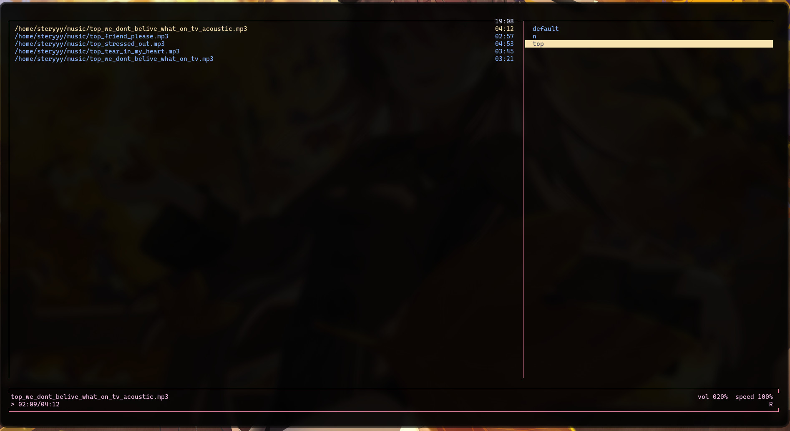

# DEPREACETED

I was creating this project when I couldn't get  [cmus](https://github.com/cmus/cmus) to work with MPRIS on Gentoo.
After a couple of months, I wanted to test cmus again, and it "worked out of the box".
I no longer see a reason for continuing this project. 

I also don't want the files to stay on my hard drive, but I don't want to lose those files either.

I will archive this project on Github. Maybe somebody will get some use out of it.

